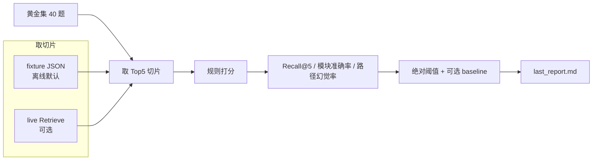

# rag-doc-eval

[](https://github.com/shani220514/rag-doc-eval/actions/workflows/eval.yml)
[](https://www.python.org/downloads/)
[](tests/)
[](LICENSE)

Offline-first **RAG retrieve evaluation** harness: golden set, rule-based Top5 scoring, **no LLM-as-judge**.

离线优先的 **RAG 检索评测脚手架**。不问「模型答得对不对」，只问：

> 给定一道题，检索返回的 Top5 切片里，有没有出现预期原文？

把 `cards/` + `sources/` 换成你自己的文档，打分器、黄金集 schema、路径白名单、密钥拦截和 CI 可以原样复用。示例语料是仓库内自写的**虚构采购订单 API**，与任何公司产品或商业文档平台无隶属关系。

中文详解：[docs/项目文档.md](docs/项目文档.md)

---


| 你看到的 | 仓库里对应什么 |
|----------|----------------|
| **只评 Retriever**，不生成答案 | `scripts/eval_retrieve.py` 只取 Top5 切片 |
| **规则打分，不用 LLM 当裁判** | `scripts/eval_scoring.py` 做大小写敏感子串命中 |
| **40 题 × 5 意图** | `eval/goldens.yaml`：穿透 / 源文档 / 模块陷阱 / 字段约束 / 路径忠实 |
| **空跑必挂** | 有效题为 0 时门禁失败，不会按 100% 误通过 |
| **密钥进不了知识库** | `scripts/sync_guard.py` 拦 `.env`、报告、Bearer / AKIA 形态 |
| **pytest 全程离线** | CI 不读 `.env`、不开网络；live Retrieve 是可选的 |

---

## 为什么做这个

多数 RAG 评测把「检索 + 生成」绑在一起：答案错了，分不清是切片没召回，还是模型没写对。LLM-as-judge 还有成本、波动、以及「用模型评模型」的循环问题。

本仓库把评测面收窄到 **Retrieve Top5**：

1. 用分层知识卡 + 对照源文档当语料  
2. 用黄金集规定「必须出现的原文针」和「不该排到 Top1 的模块」  
3. 用规则指标卡住召回、模块串扰、路径幻觉  
4. 默认 fixture / pytest，保证面试现场和 CI **可复现**

---

## 评测怎么走



两种取切片方式：

| 模式 | 网络 | `.env` | 用途 |
|------|------|--------|------|
| **Fixture（默认）** | 不开 | 不读 | 演示、CI、打分器回归 |
| **Live（可选）** | 需要密钥才发请求 | 需要 `RETRIEVE_*` | 接到真实 Retrieve 后再跑同一套门禁 |

报告里 `index_id` 为空 = fixture 证据，不是线上索引成绩。

---

## 黄金集：5 种意图

文件：[`eval/goldens.yaml`](eval/goldens.yaml) · 配额 **A=16 / B=8 / C=8 / D=4 / E=4**

| 意图 | 在测什么 | 判定 |
|------|----------|------|
| `A_penetrate` | 知识卡某一层说法能否被召回 | Top5 拼接文本包含全部 `must_hit` |
| `B_source` | `sources/api` 里的约束能否被召回 | 同上 |
| `C_module_trap` | 发运/销售类问题是否把采购订单文档错排到 Top1 | Top1 文件名落在禁止列表 → `module_mixup` |
| `D_constraint` | 字段、窗口、成对参数等硬约束 | `must_hit` 子串 |
| `E_path_faithful` | 问到的 `/v1/...` 是否被抽出且在白名单 | 路径抽取 + 白名单 |

命中规则：`must_hit` 每一项都必须作为**大小写敏感的原文子串**出现在 Top5 里。题目改了、卡片改了，针从语料里消失时，离线测试会先失败，而不是静默把题打成 miss。

---

## 指标和门禁

每题先打主分类，再汇总。优先级从高到低：

`retrieve_error` → `retrieve_miss` → `module_mixup` → `path_hallucination` → `ok`

| 指标 | 计算 | 绝对门禁 |
|------|------|----------|
| **Recall@5** | 未出现 `retrieve_miss` 的题 / 带 `must_hit` 的有效题 | ≥ 80% |
| **模块准确率** | C 类有效题中未出现 `module_mixup` 的比例 | ≥ 90% |
| **路径幻觉率** | 非法路径条数 / 抽出路径条数 | ≤ 5% |

额外硬规则：

- **有效题为 0（全失败或空题集）→ 不通过**，避免空分母显示 100%  
- 若存在人工冻结的 `eval/baseline_report.md`：Recall@5 相对下降不得超过 5 个百分点；模块准确率不得低于 baseline；路径幻觉率不得高于 baseline  
- baseline **不会**被脚本自动改写

退出码：`0` 评测通过 · `1` 评测跑完但门禁未过 · `2` 缺环境变量 / live 未实现，**不联网**

---

## 样例报告（fixture，不是线上成绩）

下面摘自仓库内 [`eval/last_report.md`](eval/last_report.md)。夹具被设计为可通过门禁，用来验证打分器、报告和 CI，**不是**在宣称真实检索效果 100%。

```
# RAG retrieve report
- index_id:            ← 空 = fixture
- retrieve_error: 0
- gate_ok: True

| metric     | current | gate                                      |
|------------|---------|-------------------------------------------|
| Recall@5   | 100.0%  | drop vs baseline ≤ 5pp and absolute ≥ 80% |
| 模块准确率 | 100.0%  | not below baseline and absolute ≥ 90%     |
| 幻觉路径率 | 0.0%    | not above baseline and absolute ≤ 5%      |
```

---

## 快速开始

需要 Python 3.10+（CI 使用 3.11）。依赖只有 `pytest` 和 `pyyaml`。

```bash
python -m pip install -r requirements.txt
python -m pytest tests/ -v
python scripts/kb_sync.py --dry-run
python scripts/eval_retrieve.py --fixture tests/fixtures/fake_retrieve.json
```

本地最近一次离线测试为 **47** 条通过。GitHub Actions 会对 `main` / PR 跑：pytest → sync dry-run → fixture 评测。

可选线上检索：复制 [`env.example`](env.example) 为 `.env`，填入 `RETRIEVE_API_KEY` / `RETRIEVE_WORKSPACE_ID` / `RETRIEVE_INDEX_ID` 后执行：

```bash
python scripts/eval_retrieve.py
```

HTTP JSON 形态与 DashScope Retrieve（`output.nodes`）兼容。缺任一变量时退出码 **2**，不发请求。

pytest 不会在 import 时读 `.env`。fixture 模式不读 `.env`。可用 `EVAL_NO_DOTENV=1` 强制跳过。`EVAL_OUT_DIR` 可把报告写到临时目录，避免覆盖仓库里已提交的报告。

---

## 换成你自己的文档

1. 替换 `cards/`、`sources/` 中的 Markdown  
2. 按同样 schema 改 `eval/goldens.yaml`（`must_hit` 必须能在语料里找到）  
3. 继续跑同一套 pytest / 打分器 / CI  

`eval/path_whitelist.yaml` 每次评测从语料重生成，不要当手改真理。

---

## 目录

```
cards/                      分层知识卡（允许同步的语料）
sources/api/                接口说明（允许同步的语料）
eval/goldens.yaml           40 题黄金集
eval/path_whitelist.yaml    从语料重生成，不要手改当真理
eval/last_report.md         最近一次评测报告
scripts/eval_retrieve.py    评测 CLI（fixture / live）
scripts/eval_scoring.py     规则打分与门禁
scripts/sync_guard.py       路径白名单 + 密钥形态拦截
scripts/kb_sync.py          --dry-run 列出 sha256；live upsert 为 v1 桩
scripts/path_extract.py     从 Markdown 抽出 /v1/... 路径
tests/                      离线 pytest（47）
.github/workflows/eval.yml  pytest + dry-run + fixture 评测
docs/项目文档.md            中文详解与面试口径
```

只有 `cards/**/*.md` 和 `sources/**/*.md` 允许进入「可上传」范围。`.env`、评测报告、密钥形态正文会被拦截。

---

## 明确不做（v1）

| 不做 | 实际行为 |
|------|----------|
| 生成式问答 | 不评测模型写出的答案 |
| LLM-as-judge | 命中判定是子串规则，不是模型打分 |
| 线上文档入库 | `kb_sync.py` 不带 `--dry-run` 时退出码 2 |
| 真实业务数据 | 仓库内没有客户文档、内部接口、账号密钥 |

已经做到：40 题黄金集、规则打分、空跑必挂、离线 pytest、GitHub Actions、sync dry-run 与密钥拦截。

---

## License

MIT。不要提交 `.env`、token 或真实客户文档。

标签：`rag` · `evaluation` · `pytest` · `retrieval` · `golden-set` · `llm-testing`
