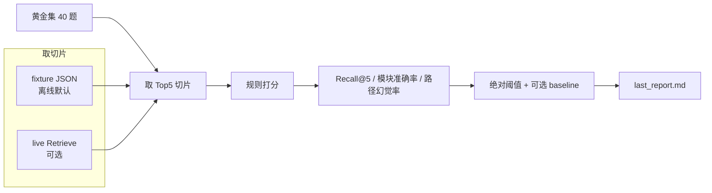

# rag-doc-eval


Offline-first **RAG retrieve evaluation** harness: golden set, rule-based Top5 scoring, plus a separate rule-scored short answer. **No LLM-as-judge**.

离线优先的 **RAG 检索评测脚手架**。检索先问 Top5 里有没有原文；生成是后一步，用规则看短答，不用模型当裁判。检索只问：

> 给定一道题，检索返回的 Top5 切片里，有没有出现预期原文？

把 `cards/` + `sources/` 换成你自己的文档，打分器、黄金集 schema、路径白名单、密钥拦截和 CI 可以原样复用。示例语料是仓库内自写的**虚构采购订单 API**，与任何公司产品或商业文档平台无隶属关系。

中文详解：[docs/项目文档.md](docs/项目文档.md)

---


| 你看到的                   | 仓库里对应什么                                              |
| ---------------------- | ---------------------------------------------------- |
| **只评 Retriever**，不生成答案 | `scripts/eval_retrieve.py` 只取 Top5 切片                |
| **规则打分，不用 LLM 当裁判**    | 检索看 `eval_scoring.py`；短答看 `eval_generate.py`            |
| **短答可换参**                | `--answers` 换正文；`--model` / `--temperature` 可选调用模型     |
| **40 题 × 5 意图**        | `eval/goldens.yaml`：穿透 / 源文档 / 模块陷阱 / 字段约束 / 路径忠实    |
| **空跑必挂**               | 有效题为 0 时门禁失败，不会按 100% 误通过                            |
| **密钥进不了知识库**           | `scripts/sync_guard.py` 拦 `.env`、报告、Bearer / AKIA 形态 |
| **pytest 全程离线**        | CI 不读 `.env`、不开网络；live Retrieve 是可选的                 |


---


## 为什么做这个

多数 RAG 评测把「检索 + 生成」绑在一起：答案错了，分不清是切片没召回，还是模型没写对。LLM-as-judge 还有成本、波动、以及「用模型评模型」的循环问题。

本仓库把评测面收窄到 **Retrieve Top5**：

1. 用分层知识卡 + 对照源文档当语料
2. 用黄金集规定「必须出现的原文针」和「不该排到 Top1 的模块」
3. 用规则指标卡住召回、模块串扰、路径幻觉
4. 默认 fixture / pytest，保证 CI **可复现**

---


## 评测怎么走


```mermaid
flowchart LR
  G["黄金集 40 题"] --> T["取 Top5 切片"]
  T --> S["规则打分"]
  S --> M["Recall@5 / 模块准确率 / 路径幻觉率"]
  M --> Gate["绝对阈值 + 可选 baseline"]
  Gate --> R["last_report.md"]

  subgraph retrieve [取切片]
    F["fixture JSON<br/>离线默认"]
    L["live Retrieve<br/>可选"]
  end
  F --> T
  L --> T
```


两种取切片方式：


| 模式              | 网络       | `.env`          | 用途                     |
| --------------- | -------- | --------------- | ---------------------- |
| **Fixture（默认）** | 不开       | 不读              | 演示、CI、打分器回归            |
| **Live（可选）**    | 需要密钥才发请求 | 需要 `RETRIEVE_`* | 接到真实 Retrieve 后再跑同一套门禁 |


报告里 `index_id` 为空 = fixture 证据，不是线上索引成绩。

---


## 黄金集：5 种意图

文件：`[eval/goldens.yaml](eval/goldens.yaml)` · 配额 **A=16 / B=8 / C=8 / D=4 / E=4**


| 意图                | 在测什么                      | 判定                              |
| ----------------- | ------------------------- | ------------------------------- |
| `A_penetrate`     | 知识卡某一层说法能否被召回             | Top5 拼接文本包含全部 `must_hit`        |
| `B_source`        | `sources/api` 里的约束能否被召回   | 同上                              |
| `C_module_trap`   | 发运/销售类问题是否把采购订单文档错排到 Top1 | Top1 文件名落在禁止列表 → `module_mixup` |
| `D_constraint`    | 字段、窗口、成对参数等硬约束            | `must_hit` 子串                   |
| `E_path_faithful` | 问到的 `/v1/...` 是否被抽出且在白名单  | 路径抽取 + 白名单                      |


命中规则：`must_hit` 每一项都必须作为**大小写敏感的原文子串**出现在 Top5 里。题目改了、卡片改了，针从语料里消失时，离线测试会先失败，而不是静默把题打成 miss。

---


## 指标和门禁

每题先打主分类，再汇总。优先级从高到低：

`retrieve_error` → `retrieve_miss` → `module_mixup` → `path_hallucination` → `ok`


| 指标           | 计算                                         | 绝对门禁  |
| ------------ | ------------------------------------------ | ----- |
| **Recall@5** | 未出现 `retrieve_miss` 的题 / 带 `must_hit` 的有效题 | ≥ 80% |
| **模块准确率**    | C 类有效题中未出现 `module_mixup` 的比例              | ≥ 90% |
| **路径幻觉率**    | 非法路径条数 / 抽出路径条数                            | ≤ 5%  |


额外硬规则：

- **有效题为 0（全失败或空题集）→ 不通过**，避免空分母显示 100%  
- 若存在人工冻结的 `eval/baseline_report.md`：Recall@5 相对下降不得超过 5 个百分点；模块准确率不得低于 baseline；路径幻觉率不得高于 baseline  
- baseline **不会**被脚本自动改写

退出码：`0` 评测通过 · `1` 评测跑完但门禁未过 · `2` 缺环境变量 / live 未实现，**不联网**

---


## 样例报告（fixture，不是线上成绩）

下面摘自仓库内 `[eval/last_report.md](eval/last_report.md)`。夹具被设计为可通过门禁，用来验证打分器、报告和 CI，**不是**在宣称真实检索效果 100%。

```
# RAG retrieve report
- index_id:            ← 空 = fixture
- retrieve_error: 0
- gate_ok: True

| metric     | current | gate                                      |
|------------|---------|-------------------------------------------|
| Recall@5   | 100.0%  | drop vs baseline ≤ 5pp and absolute ≥ 80% |
| 模块准确率 | 100.0%  | not below baseline and absolute ≥ 90%     |
| 幻觉路径率 | 0.0%    | not above baseline and absolute ≤ 5%      |
```

---


## 快速开始

需要 Python 3.10+（CI 使用 3.11）。依赖只有 `pytest` 和 `pyyaml`。

```bash
python -m pip install -r requirements.txt
python -m pytest tests/ -v
python scripts/kb_sync.py --dry-run
python scripts/eval_retrieve.py --fixture tests/fixtures/fake_retrieve.json
python scripts/eval_generate.py --fixture tests/fixtures/fake_retrieve.json --answers tests/fixtures/fake_answers.json
```

本地离线测试见 pytest 结果。GitHub Actions 会对 `main` / PR 跑：pytest → sync dry-run → fixture 检索评测 → fixture 生成评测。

可选线上检索：复制 `[env.example](env.example)` 为 `.env`，填入 `RETRIEVE_API_KEY` / `RETRIEVE_WORKSPACE_ID` / `RETRIEVE_INDEX_ID` 后执行：

```bash
python scripts/eval_retrieve.py
```

HTTP JSON 形态与 DashScope Retrieve（`output.nodes`）兼容。缺任一变量时退出码 **2**，不发请求。

pytest 不会在 import 时读 `.env`。fixture 模式不读 `.env`。可用 `EVAL_NO_DOTENV=1` 强制跳过。`EVAL_OUT_DIR` 可把报告写到临时目录，避免覆盖仓库里已提交的报告。

---


## 换成你自己的文档

1. 替换 `cards/`、`sources/` 中的 Markdown
2. 按同样 schema 改 `eval/goldens.yaml`（`must_hit` 必须能在语料里找到）
3. 继续跑同一套 pytest / 打分器 / CI

`eval/path_whitelist.yaml` 每次评测从语料重生成，不要当手改真理。

---


## 目录

```
cards/                      分层知识卡（允许同步的语料）
sources/api/                接口说明（允许同步的语料）
eval/goldens.yaml           40 题黄金集
eval/path_whitelist.yaml    从语料重生成，不要手改当真理
eval/last_report.md         最近一次评测报告
scripts/eval_retrieve.py    检索评测 CLI（fixture / live）
scripts/eval_generate.py    生成评测 CLI（--answers 或 --model / --temperature）
scripts/eval_scoring.py     检索规则打分与门禁
scripts/chunk_md.py         按标题把 Markdown 切成段
scripts/sync_guard.py       路径白名单 + 密钥形态拦截
scripts/kb_sync.py          --dry-run 列出每段 chunk_id 与 sha256；live upsert 为 v1 桩
scripts/path_extract.py     从 Markdown 抽出 /v1/... 路径
tests/                      离线 pytest（68）
.github/workflows/eval.yml  pytest + dry-run + fixture 评测
docs/项目文档.md            中文详解
```

只有 `cards/**/*.md` 和 `sources/**/*.md` 允许进入「可上传」范围。`.env`、评测报告、密钥形态正文会被拦截。

---


## 明确不做（v1）


| 不做           | 实际行为                               |
| ------------ | ---------------------------------- |
| 生成混进检索分      | 短答写 `last_generate_report.md`，不改检索门禁 |
| LLM-as-judge | 命中判定是子串规则，不是模型打分                   |
| 线上文档入库       | `kb_sync.py` 不带 `--dry-run` 时退出码 2 |
| 真实业务数据       | 仓库内没有客户文档、内部接口、账号密钥                |


已经做到：40 题黄金集、按标题切片、检索规则打分、生成短答规则打分（`--answers` / `--model` / `--temperature`）、空跑必挂、离线 pytest、GitHub Actions、sync dry-run 与密钥拦截。

---


## License

MIT。不要提交 `.env`、token 或真实客户文档。

标签：`rag` · `evaluation` · `pytest` · `retrieval` · `golden-set` · `llm-testing`


在仓库根目录按这个顺序跑即可，和 CI 是同一套离线链路。

## 日常调试（不联网）

```powershell
python -m pip install -r requirements.txt
python -m pytest tests/ -v
python scripts/kb_sync.py --dry-run
python scripts/eval_retrieve.py --fixture tests/fixtures/fake_retrieve.json
python scripts/eval_generate.py --fixture tests/fixtures/fake_retrieve.json --answers tests/fixtures/fake_answers.json --temperature 0.2
```

`--answers` 在时，`--model` 和 `--temperature` 不生效。去掉 `--answers` 并设置 `GENERATE_API_KEY` 后，才会按 `--model` / `--temperature` 写短答。

| 命令 | 作用 | 通过时 |
|------|------|--------|
| `pytest tests/ -v` | 全部离线单测 | 退出码 0 |
| `kb_sync.py --dry-run` | 按标题列出可入库切片 + sha256 | 退出码 0 |
| `eval_retrieve.py --fixture ...` | 正式 40 题 + 假 Top5 | 退出码 0，写 `eval/last_report.md` |
| `eval_generate.py --answers ...` | 同一批 Top5 + 夹具短答 | 退出码 0，写 `last_generate_report.md` |

看正式报告：`eval/last_report.md`。

## 样例评测（故意挂门禁）

```powershell
python scripts/eval_retrieve.py --goldens eval/samples/metrics-40-30-20/goldens.yaml --fixture eval/samples/metrics-40-30-20/fake_retrieve.json
```

退出码 **1**。报告在 `eval/samples/metrics-40-30-20/last_report.md`，以及同目录 `last_report_时间戳.md`。正式 40 题报告不会被改。

## DF 订单样例（另一份黄金集）

同一套 `eval/samples/df-order/goldens.yaml`（12 题，来自 `cards/DF-order.md`）。正式 40 题不改。

```powershell
# 未挂门禁，退出码 0。报告：eval/samples/df-order/last_report.md
python scripts/eval_retrieve.py --goldens eval/samples/df-order/goldens.yaml --fixture eval/samples/df-order/fake_retrieve.json

# 故意挂门禁，退出码 1。报告：eval/samples/df-order/gate-fail/last_report.md
python scripts/eval_retrieve.py --goldens eval/samples/df-order/goldens.yaml --fixture eval/samples/df-order/fake_retrieve_fail.json --out-dir eval/samples/df-order/gate-fail
```

## 只跑某一个测试

```powershell
python -m pytest tests/test_eval_scoring.py -v
python -m pytest tests/test_goldens_schema.py -v
python -m pytest tests/test_sample_metrics_40_30_20.py -v
```

## 可选：接真实 Retrieve

```powershell
copy env.example .env
# 填写 RETRIEVE_API_KEY / RETRIEVE_WORKSPACE_ID / RETRIEVE_INDEX_ID
python scripts/eval_retrieve.py
```

缺变量会退出码 **2**，不发请求。

## 常用环境变量

```powershell
$env:EVAL_NO_DOTENV = "1"
$env:EVAL_OUT_DIR = "tmp-eval"
```

`EVAL_OUT_DIR` 可把报告写到临时目录，避免覆盖已提交的 `eval/last_report.md`。

退出码：**0** 门禁通过 · **1** 评测完但未过 · **2** 缺环境 / live 未实现。